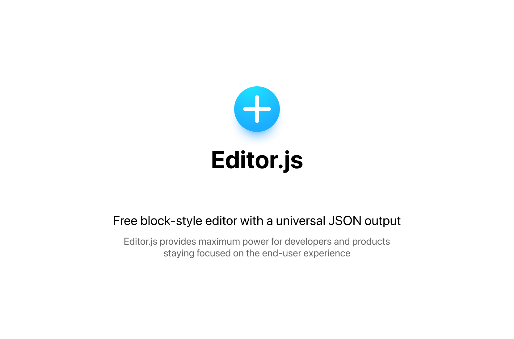

<p align="center">
  <a href="https://editorjs.io/">
    <picture>
      <source media="(prefers-color-scheme: dark)"  srcset="./assets/logo_night.png">
      <source media="(prefers-color-scheme: light)" srcset="./assets/logo_day.png">
      
    </picture>    
  </a>
</p>

<p align="center">
 <a href="https://editorjs.io/">editorjs.io</a> |
  <a href="https://editorjs.io/base-concepts/">documentation</a> |
  <a href="https://github.com/codex-team/editor.js/blob/next/docs/CHANGELOG.md">changelog</a>
  
</p>

<p align="center">
  <a href="https://www.npmjs.com/package/@editorjs/editorjs">
    
  </a>
  <a href="https://www.npmjs.com/package/@editorjs/editorjs">
    
  </a>
  <a href="https://github.com/codex-team/editor.js#backers">
    
  </a>
  <a href="https://github.com/codex-team/editor.js#sponsors">
    
  </a>
</p>

## About

Editor.js is an open-source text editor offering a variety of features to help users create and format content efficiently. It has a modern, block-style interface that allows users to easily add and arrange different types of content, such as text, images, lists, quotes, etc. Each Block is provided via a separate plugin making Editor.js extremely flexible.

Editor.js outputs a clean JSON data instead of heavy HTML markup. Use it in Web, iOS, Android, AMP, Instant Articles, speech readers, AI chatbots — everywhere. Easy to sanitize, extend and integrate with your logic. 

- 😍  Modern UI out of the box
- 💎  Clean JSON output
- ⚙️  Well-designed API
- 🛍  Various Tools available
- 💌  Free and open source

<picture>
  
</picture>   

## Installation

It's quite simple:

1. Install Editor.js 
2. Install tools you need
3. Initialize Editor's instance

Install using NPM, Yarn, or [CDN](https://www.jsdelivr.com/package/npm/@editorjs/editorjs):

```bash
npm i @editorjs/editorjs
```

Choose and install tools:

- [Heading](https://github.com/editor-js/header)
- [Quote](https://github.com/editor-js/quote)
- [Image](https://github.com/editor-js/image) 
- [Simple Image](https://github.com/editor-js/simple-image) (without backend requirement)
- [Nested List](https://github.com/editor-js/nested-list)
- [Checklist](https://github.com/editor-js/checklist)
- [Link embed](https://github.com/editor-js/link)
- [Embeds](https://github.com/editor-js/embed) (YouTube, Twitch, Vimeo, Gfycat, Instagram, Twitter, etc)
- [Table](https://github.com/editor-js/table)
- [Delimiter](https://github.com/editor-js/delimiter)
- [Warning](https://github.com/editor-js/warning)
- [Code](https://github.com/editor-js/code)
- [Raw HTML](https://github.com/editor-js/raw)
- [Attaches](https://github.com/editor-js/attaches)
- [Marker](https://github.com/editor-js/marker)
- [Inline Code](https://github.com/editor-js/inline-code)

See the [😎 Awesome Editor.js](https://github.com/editor-js/awesome-editorjs) list for more tools.

Initialize the Editor:

```html
<div id="editorjs"></div>
```

```javascript
import EditorJS from '@editorjs/editorjs'

const editor = new EditorJS({
  tools: {
   // ... your tools
  }
})
````

See details about [Installation](https://editorjs.io/getting-started/) and [Configuration](https://editorjs.io/configuration/) at the documentation.

### Saving Data

Call `editor.save()` and handle returned Promise with saved data.

```javascript
const data = await editor.save()
```

### Example

Take a look at the [example.html](example/example.html) to view more detailed examples.


## Roadmap


- Unified Toolbox
  - [x] Block Tunes moved left
  - [x] Toolbox becomes vertical
  - [x] Ability to display several Toolbox buttons by the single Tool
  - [x] Block Tunes become vertical
  - [ ] Block Tunes support nested menus
  - [ ] Conversion Toolbar uses Unified Toolbox
  - [ ] Conversion Toolbar added to the Block Tunes
- Collaborative editing
  - [ ] Implement Inline Tools JSON format
  - [ ] Operations Observer, Executor, Manager, Transformer
  - [ ] Implement Undo/Redo Manager
  - [ ] Implement Tools API changes
  - [ ] Implement Server and communication
  - [ ] Update basic tools to fit the new API
- Other features
  - [ ] Blocks drag'n'drop
  - [ ] New cross-block selection
  - [ ] New cross-block caret moving
- Ecosystem improvements
  - [x] CodeX Icons — the way to unify all tools and core icons
  - [x] New Homepage and Docs
  - [x] @editorjs/create-tool for Tools bootstrapping
  - [ ] Editor.js DevTools — stand for core and tools development
  - [ ] Editor.js Design System
  - [ ] Editor.js Preset Env
  - [ ] Editor.js ToolKit
  - [ ] New core bundle system
  - [ ] New documentation and guides

<a href="https://opencollective.com/editorjs/donate" target="_blank">
  <picture>
    <source width="162px" media="(prefers-color-scheme: dark)"  srcset="./assets/support_night.png">
    <source width="162px" media="(prefers-color-scheme: light)" srcset="./assets/support_day.png">
    
  </picture>
</a>

<br>

## Like Editor.js?

You can support project improvement and development of new features with a donation to our team.

[Donate via OpenCollective](https://opencollective.com/editorjs)
\
[Donate via Crypto](https://codex.so/donate)
\
[Donate via Patreon](https://www.patreon.com/editorjs)

### Why donate

Donations to open-source products have several advantages for your business:

- If your business relies on Editor.js, you'll probably want it to be maintained
- It helps Editor.js to evolve and get the new features
- We can support contributors and the community around the project. You'll receive well organized docs, guides, etc.
- We need to pay for our infrastructure and maintain public resources (domain names, homepages, docs, etc). Supporting it guarantees you to access any resources at the time you need them.
- You can advertise by adding your brand assets and mentions on our public resources


### Sponsors

Support us by becoming a sponsor. Your logo will show up here with a link to your website.

<p>
  <a href="https://www.mister-auto.com/" target="_blank">
    
  </a>
  <a href="https://www.uplucid.com/" target="_blank">
    
  </a>
  <a href="https://www.contentharmony.com/" target="_blank">
    
  </a>
  <a href="https://www.contentharmony.com/product/" target="_blank">
    
  </a>
</p>

[Become a Sponsor](https://opencollective.com/editorjs/contribute/sir-8679/checkout)

### Backers
 Thank you to all our backers

<a href="https://opencollective.com/editorjs#backers" target="_blank"></a>

[Become a Backer](https://opencollective.com/editorjs/contribute/backer-8632/checkout)

### Contributors

This project exists thanks to all the people who contribute. 

<p></p>

### Need something special?

Hire CodeX experts to resolve technical challenges and match your product requirements. 

- Resolve a problem that has high value for you
- Implement a new feature required by your business
- Help with integration or tool development
- Provide any consultation

Contact us via team@codex.so and share your details

## Community

- [Official Tools](https://github.com/editor-js)
- [Awesome Editor.js](https://github.com/editor-js/awesome-editorjs)
- [Good First Tasks](https://github.com/codex-team/editor.js/issues?q=is%3Aopen+is%3Aissue+label%3A%22good+first+task%22)
- [Contributing](https://editorjs.io/contributing/)
- [Telegram Chat](https://t.me/codex_editor)

# About CodeX


CodeX is a team of digital specialists around the world interested in building high-quality open source products on a global market. We are [open](https://codex.so/join) for young people who want to constantly improve their skills and grow professionally with experiments in cutting-edge technologies.

| 🌐 | Join  👋  | Twitter | Instagram |
| -- | -- | -- | -- |
| [codex.so](https://codex.so) | [codex.so/join](https://codex.so/join) |[@codex_team](http://twitter.com/codex_team) | [@codex_team](http://instagram.com/codex_team/) |
