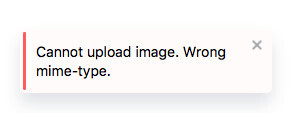

# Editor.js API

---
Most actual API described by [this interface](../types/api/index.d.ts).

---
📃 See official API documentation [https://editorjs.io/api](https://editorjs.io/api)

---

Tools have access to the public methods provided by Editor.js API Module. Plugin and Tune Developers
can use Editor\`s API as they want.

## Block API

API for certain Block methods and properties. You can access it through `editor.api.block.getBlockByIndex` method or get it form `block` property of [Tool constructor](../types/tools/block-tool.d.ts) argument.

`name: string` — Block's Tool name (key, specified in `tools` property of initial configuration)

`config: ToolConfig` — Tool config passed on Editor initialization

`holder: HTMLElement` — HTML Element that wraps Tool's HTML content

`isEmpty: boolean` — `true` if Block has any editable content

`selected: boolean` - `true` if Block is selected with Cross-Block Selection

`set stretched(state: boolean)` — set Block's stretch state

`stretched: boolean` — `true` if Block is stretched

`call(methodName: string, param?: object): void` — method to call any Tool's instance methods with checks and error handlers under-the-hood. For example, [Block lifecycle hooks](./tools.md#block-lifecycle-hooks)

`save(): Promise<void|SavedData>` — returns data saved from current Block's state, including Tool name and saving exec time

`validate(data: BlockToolData): Promise<boolean>` — calls Tool's validate method if exists

`dispatchChange(): void` - Allows to say Editor that Block was changed. Used to manually trigger Editor's 'onChange' callback. Can be useful for block changes invisible for editor core.

## Api object description

Common API interface.

```js
export interface API {
   blocks: IBlocksAPI;
   caret: ICaretAPI;
   sanitizer: ISanitizerAPI;
   toolbar: IToolbarAPI;
   // ...
 }
 ```

#### BlocksAPI

Methods that working with Blocks

`render(data)` - render passed JSON data

`renderFromHTML(data)` - parse and render passed HTML string (*not for production use*)

`swap(fromIndex, toIndex)` - swaps two Blocks by their positions (deprecated:
use 'move' instead)

`move(toIndex, fromIndex)` - moves block from one index to another position.
`fromIndex` will be the current block's index by default.

`delete(blockIndex?: Number)` - deletes Block with passed index

`getCurrentBlockIndex()` - current Block index

`getBlockByIndex(index: Number)` - returns Block API object by passed index

`getBlocksCount()` - returns Blocks count

`stretchBlock(index: number, status: boolean)` - _Deprecated. Use Block API interface instead._ make Block stretched.

`insertNewBlock()` - __Deprecated__ insert new Block after working place

`insert(type?: string, data?: BlockToolData, config?: ToolConfig, index?: number, needToFocus?: boolean)` - insert new Block with passed parameters

`update(id: string, data?: BlockToolData, tunes?: {[name: string]: BlockTuneData})` - updates block data and block tunes for the block with passed id

#### SanitizerAPI

`clean(taintString, config)` - method uses HTMLJanitor to clean taint string.

Editor.js provides basic config without attributes, but you can inherit by passing your own config.

If Tool enables inline-tools, we get it's sanitizing rules and merge with your passed custom rules.

Usage:

```js
let taintString = '<div><p style="font-size: 5em;"><b></b>BlockWithText<a onclick="void(0)"></div>'
let customConfig = {
  b: true,
  p: {
    style: true,
  },
}
this.api.sanitizer.clean(taintString, customConfig);
```

### ToolbarAPI

Methods that working with Toolbar

`open()` - opens toolbar

`close()` - closes toolbar, toolbox and blockSettings if they are opened

### InlineToolbarAPI

Methods that works with inline toolbar

`open()` - opens inline toolbar, (opens for the current selection)

`close()` - closes inline toolbar

### ListenerAPI

Methods that allows to work with DOM listener. Useful when you forgot to remove listener. Module collects all listeners and destroys automatically

`on(element: HTMLElement, eventType: string, handler: Function, useCapture?: boolean)` - add event listener to HTML element

`off(element: HTMLElement, eventType: string, handler: Function)` - remove event handler from HTML element


### CaretAPI

Methods to manage caret position.

Each method accept `position` and `offset` parameters. `Offset` should be used to shift caret by passed amount of characters.

`Position` can be one of the following values:

| Value     | Description
| --------- | -----------
| `start`   | Caret will be set at the Block's beginning
| `end`     | Caret will be set at the Block end
| `default` | More or less emulates browser behaviour, in most cases behaves as `start`

Each method returns `boolean` value: true if caret is set successfully or false otherwise (e.g. when there is no Block at index);

`setToFirstBlock(position?: 'end'|'start'|'default', offset?: number): boolean;` — set caret to the first Block

`setToLastBlock(position?: 'end'|'start'|'default', offset?: number): boolean;` — set caret to the last Block

`setToNextBlock(position?: 'end'|'start'|'default', offset?: number): boolean;` — set caret to the next Block

`setToPreviousBlock(position?: 'end'|'start'|'default', offset?: number): boolean;` — set caret to the previous Block

`setToBlock(index: number, position?: 'end'|'start'|'default', offset?: number): boolean;` — set caret to the Block by passed `index`

`focus(atEnd?: boolean): boolean;` — set caret to the Editor. If `atEnd` is true, set it at the end.

### NotifierAPI

If you need to show any messages for success or failure events you can use notifications module.

Call on target Editor:

```javascript
let editor = new EditorJS({
  onReady: () => {
    editor.notifier.show({
      message: 'Editor is ready!'
    });
  },
});
```

In Tool's class:

```javascript
this.api.notifier.show({
  message: 'Cannot upload image. Wrong mime-type.',
  style: 'error',
});
```




Check out [`codex-notifier` package page](https://github.com/codex-team/js-notifier) on GitHub to find docs, params and examples.

### Destroy API

If there are necessity to remove Editor.js instance from the page you can use `destroy()` method.

It makes following steps:

1. Clear the holder element by setting it\`s innerHTML to empty string

2. Remove all event listeners related to Editor.js

3. Delete all properties from instance object and set it\`s prototype to `null`

After executing the `destroy` method, editor inctance becomes an empty object. This way you will free occupied JS Heap on your page.

### Tooltip API

Methods for showing Tooltip helper near your elements. Parameters are the same as in [CodeX Tooltips](http://github.com/codex-team/codex.tooltips) lib.

#### Show

Method shows tooltip with custom content on passed element

```js
this.api.tooltip.show(element, content, options);
```

| parameter | type | description |
| -- | -- | -- |
| `element` | _HTMLElement_ | Tooltip will be showed near this element |
| `content` | _String_ or _Node_ | Content that will be appended to the Tooltip |
| `options` | _Object_ | Some displaying options, see below |

Available showing options

| name | type | action |
| -- | -- | -- |
| placement | `top`, `bottom`, `left`, `right` | Where to place the tooltip. Default value is `bottom' |
| marginTop | _Number_ | Offset above the tooltip with `top` placement |
| marginBottom | _Number_ | Offset below the tooltip with `bottom` placement |
| marginLeft | _Number_ | Offset at left from the tooltip with `left` placement |
| marginRight | _Number_ | Offset at right from the tooltip with `right` placement |
| delay | _Number_ | Delay before showing, in ms. Default is `70` |
| hidingDelay | _Number_ | Delay before hiding, in ms. Default is `0` |

#### Hide

Method hides the Tooltip.

```js
this.api.tooltip.hide();
```

#### onHover

Decorator for showing tooltip near some element by "mouseenter" and hide by "mouseleave".

```js
this.api.tooltip.onHover(element, content, options);
```

### API Shorthands

Editor`s API provides some shorthands for API methods.

| Alias    | Method          |
| ------   | --------------- |
| `clear`  | `blocks.clear`  |
| `render` | `blocks.render` |
| `focus`  | `caret.focus`   |
| `save`   | `saver.save`    |

> Example

```javascript
const editor = EditorJS();

editor.focus();
editor.save();
```

