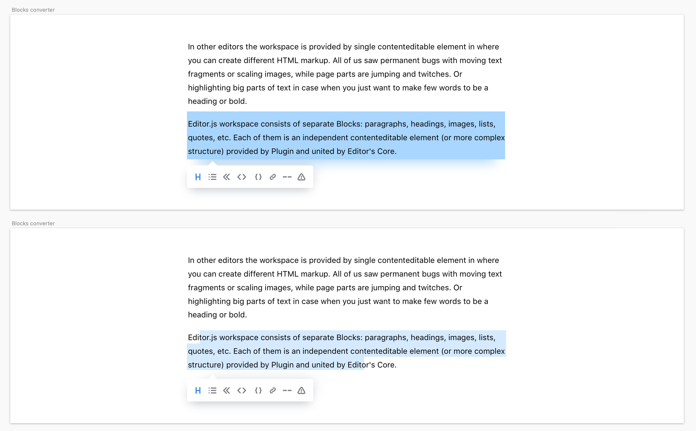

# Editor.js Tools

Editor.js is a block-oriented editor. It means that entry composed with the list of `Blocks` of different types: `Texts`, `Headers`, `Images`, `Quotes` etc.

`Tool` — is a class that provide custom `Block` type. All Tools represented by `Plugins`.

Each Tool should have an installation guide.

## Tool class structure

### constructor()

Each Tool's instance called with an params object.

| Param  | Type                                                   | Description                                     |
| ------ | ------------------------------------------------------ | ----------------------------------------------- |
| api    | [`IAPI`](../types/index.d.ts)                          | Editor.js's API methods                         |
| config | [`ToolConfig`](../types/tools/tool-config.d.ts)        | Special configuration params passed in «config» |
| data   | [`BlockToolData`](../types/tools/block-tool-data.d.ts) | Data to be rendered in this Tool                |
| block  | [`BlockAPI`](../types/api/block.d.ts)                  | Block's API methods                             |

[iapi-link]: ../src/types-internal/api.ts

#### Example

```javascript
constructor({data, config, api}) {
  this.data = data;
  this.api = api;
  this.config = config;
  // ...
}
```

### render()

Method that returns Tool's element {HTMLElement} that will be placed into Editor.

### save()

Process Tool's element created by `render()` function in DOM and return Block's data.

### validate(data: BlockToolData): boolean|Promise\<boolean\> _optional_

Allows to check correctness of Tool's data. If data didn't pass the validation it won't be saved. Receives Tool's `data` as input param and returns `boolean` result of validation.

### merge() _optional_

Method that specifies how to merge two `Blocks` of the same type, for example on `Backspace` keypress.
Method does accept data object in same format as the `Render` and it should provide logic how to combine new
data with the currently stored value.

## Internal Tool Settings

Options that Tool can specify. All settings should be passed as static properties of Tool's class.

| Name | Type | Default Value | Description |
| -- | -- | -- | -- |
| `toolbox` | _Object_ | `undefined` | Pass the `icon` and the `title` there to display this `Tool` in the Editor's `Toolbox` <br /> `icon` - HTML string with icon for the Toolbox <br /> `title` - title to be displayed at the Toolbox. <br /><br />May contain an array of `{icon, title, data}` to display the several variants of the tool, for example "Ordered list", "Unordered list". See details at [the documentation](https://editorjs.io/tools-api#toolbox) |
| `enableLineBreaks` | _Boolean_ | `false` | With this option, Editor.js won't handle Enter keydowns. Can be helpful for Tools like `<code>` where line breaks should be handled by default behaviour. |
| `isInline` | _Boolean_ | `false` | Describes Tool as a [Tool for the Inline Toolbar](tools-inline.md) |
| `isTune` | _Boolean_ | `false` | Describes Tool as a [Block Tune](block-tunes.md) |
| `sanitize` | _Object_ | `undefined` | Config for automatic sanitizing of saved data. See [Sanitize](#sanitize) section. |
| `conversionConfig` | _Object_ | `undefined` | Config allows Tool to specify how it can be converted into/from another Tool. See [Conversion config](#conversion-config) section. |

## User configuration

All Tools can be configured by users. You can set up some of available settings along with Tool's class
to the `tools` property of Editor Config.

```javascript
var editor = new EditorJS({
  holder : 'editorjs',
  tools: {
    text: {
      class: Text,
      inlineToolbar : true,
      // other settings..
    },
    header: Header
  },
  defaultBlock : 'text',
});
```

There are few options available by Editor.js.

| Name | Type | Default Value | Description |
| -- | -- | -- | -- |
| `inlineToolbar` | _Boolean/Array_ | `false` | Pass `true` to enable the Inline Toolbar with all Tools, or pass an array with specified Tools list |
| `config` | _Object_ | `null` | User's configuration for Plugin.

## Tool prepare and reset

If you need to prepare some data for Tool (eg. load external script, create HTML nodes in the document, etc) you can use static prepare method.

It accepts tools config passed on Editor's initialization as an argument:

```javascript
class Tool {
  static prepare(config) {
    loadScript();
    insertNodes();
    ...
  }
}
```

On Editor destroy you can use an opposite method `reset` to clean up all prepared data:

```javascript
class Tool {
  static reset() {
    cleanUpScripts();
    deleteNodes();
    ...
  }
}
```

Both methods might be async.

## Paste handling

Editor.js handles paste on Blocks and provides API for Tools to process the pasted data.

When user pastes content into Editor, pasted content will be splitted into blocks.

1. If plain text will be pasted, it will be splitted by new line characters
2. If HTML string will be pasted, it will be splitted by block tags

Also Editor API allows you to define your own pasting scenario. You can either:

1. Specify **HTML tags**, that can be represented by your Tool. For example, Image Tool can handle `` tags.
If tags you specified will be found on content pasting, your Tool will be rendered.
2. Specify **RegExp** for pasted strings. If pattern has been matched, your Tool will be rendered.
3. Specify **MIME type** or **extensions** of files that can be handled by your Tool on pasting by drag-n-drop or from clipboard.

For each scenario, you should do 2 next things:

1. Define static getter `pasteConfig` in Tool class. Specify handled patterns there.
2. Define public method `onPaste` that will handle PasteEvent to process pasted data.

### HTML tags handling

To handle pasted HTML elements object returned from `pasteConfig` getter should contain following field:

| Name | Type | Description |
| -- | -- | -- |
| `tags` | `String[]` | _Optional_. Should contain all tag names you want to be extracted from pasted data and processed by your `onPaste` method |

For correct work you MUST provide `onPaste` handler at least for `defaultBlock` Tool.

#### Example

Header Tool can handle `H1`-`H6` tags using paste handling API

```javascript
static get pasteConfig() {
  return {
    tags: ['H1', 'H2', 'H3', 'H4', 'H5', 'H6'],
  }
}
```

**Note. Same tag can be handled by one (first specified) Tool only.**

**Note. All attributes of pasted tag will be removed. To leave some attribute, you should explicitly specify them. Se below**

Let's suppose you want to leave the 'src' attribute when handle pasting of the `img` tags. Your config should look like this:

```javascript
static get pasteConfig() {
  return {
    tags: [
      {
        img: {
          src: true
        }
      }
    ],
  }
}
```

[Read more](https://editorjs.io/sanitizer) about the sanitizing configuration.

### RegExp patterns handling

Your Tool can analyze text by RegExp patterns to substitute pasted string with data you want. Object returned from `pasteConfig` getter should contain following field to use patterns:

| Name | Type | Description |
| -- | -- | -- |
| `patterns` | `Object` | _Optional_. `patterns` object contains RegExp patterns with their names as object's keys |

**Note** Editor will check pattern's full match, so don't forget to handle all available chars in there.

Pattern will be processed only if paste was on `defaultBlock` Tool and pasted string length is less than 450 characters.

> Example

You can handle YouTube links and insert embeded video instead:

```javascript
static get pasteConfig() {
  return {
    patterns: {
      youtube: /http(?:s?):\/\/(?:www\.)?youtu(?:be\.com\/watch\?v=|\.be\/)([\w\-\_]*)(&(amp;)?[\w\?‌​=]*)?/
    },
  }
}
```

### Files pasting

Your Tool can handle files pasted or dropped into the Editor.

To handle file you should provide `files`  property in your `pasteConfig` configuration object.

`files` property is an object with the following fields:

| Name | Type | Description |
| ---- | ---- | ----------- |
| `extensions` | `string[]` | _Optional_ Array of extensions your Tool can handle |
| `mimeTypes` | `sring[]` | _Optional_ Array of MIME types your Tool can handle |

Example

```javascript
static get pasteConfig() {
  return {
    files: {
      mimeTypes: ['image/png'],
      extensions: ['json']
    }
  }
}
```

### Pasted data handling

If you registered some paste substitutions in `pasteConfig` property, you **should** provide `onPaste` callback in your Tool class.
`onPaste` should be public non-static method. It accepts custom _PasteEvent_ object as argument.

PasteEvent is an alias for three types of events - `tag`, `pattern` and `file`. You can get the type from _PasteEvent_ object's `type` property.
Each of these events provide `detail` property with info about pasted content.

| Type  | Detail |
| ----- | ------ |
| `tag` | `data` - pasted HTML element |
| `pattern` | `key` - matched pattern key you specified in `pasteConfig` object <br /> `data` - pasted string |
| `file` | `file` - pasted file |

Example

```javascript
onPaste (event) {
  switch (event.type) {
    case 'tag':
      const element = event.detail.data;

      this.handleHTMLPaste(element);
      break;

    case 'pattern':
      const text = event.detail.data;
      const key = event.detail.key;

      this.handlePatternPaste(key, text);
      break;

    case 'file':
      const file = event.detail.file;

      this.handleFilePaste(file);
      break;
  }
}
```

### Disable paste handling

If you need to disable paste handling on your Tool for some reason, you can provide `false` as `pasteConfig` value.
That way paste event won't be processed if fired on your Tool:

```javascript
static get pasteConfig {
  return false;
}
```

## Sanitize <a name="sanitize"></a>

Editor.js provides [API](sanitizer.md) to clean taint strings.
Use it manually at the `save()` method or or pass `sanitizer` config to do it automatically.

### Sanitizer Configuration

The example of sanitizer configuration

```javascript
let sanitizerConfig = {
  b: true, // leave <b>
  p: true, // leave <p>
}
```

Keys of config object is tags and the values is a rules.

#### Rule

Rule can be boolean, object or function. Object is a dictionary of rules for tag's attributes.

You can set `true`, to allow tag with all attributes or `false|{}` to remove all attributes,
but leave tag.

Also you can pass special attributes that you want to leave.

```javascript
a: {
  href: true
}
```

If you want to use a custom handler, use should specify a function
that returns a rule.

```javascript
b: function(el) {
  return !el.textContent.includes('bad text');
}
```

or

```javascript
a: function(el) {
  let anchorHref = el.getAttribute('href');
  if (anchorHref && anchorHref.substring(0, 4) === 'http') {
    return {
      href: true,
      target: '_blank'
    }
  } else {
    return {
      href: true
    }
  }
}
```

### Manual sanitize

Call API method `sanitizer.clean()` at the save method for each field in returned data.

```javascript
save() {
  return {
    text: this.api.sanitizer.clean(taintString, sanitizerConfig)
  }
}
```

### Automatic sanitize

If you pass the sanitizer config as static getter, Editor.js will automatically sanitize your saved data.

Note that if your Tool is allowed to use the Inline Toolbar, we will get sanitizing rules for each Inline Tool
and merge with your passed config.

You can define rules for each field

```javascript
static get sanitize() {
  return {
    text: {},
    items: {
      b: true, // leave <b>
      a: false, // remove <a>
    }
  }
}
```

Don't forget to set the rule for each embedded subitems otherwise they will
not be sanitized.

if you want to sanitize everything and get data without any tags, use `{}` or just
ignore field in case if you want to get pure HTML

```javascript
static get sanitize() {
  return {
    text: {},
    items: {}, // this rules will be used for all properties of this object
    // or
    items: {
      // other objects here won't be sanitized
      subitems: {
        // leave <a> and <b> in subitems
        a: true,
        b: true,
      }
    }
  }
}
```

## Conversion config <a name="conversion-config"></a>

Editor.js has a Conversion Toolbar that allows user to convert one Block to another.



1. You can add ability to your Tool to be converted. Specify «export» property of `conversionConfig`.
2. You can add ability to convert other Tools to your Tool. Specify «import» property of `conversionConfig`.

Conversion Toolbar will be shown only near Blocks that specified an «export» rule, when user selected almost all block's content.
This Toolbar will contain only Tools that specified an «import» rule.

Example:

```js
class Header {
  constructor(){
    this.data = {
       text: '',
       level: 2
    }
  }

  /**
   * Rules specified how our Tool can be converted to/from other Tool.
   */
  static get conversionConfig() {
    return {
      export: 'text', // this property of tool data will be used as string to pass to other tool
      import: 'text' // to this property imported string will be passed
    };
  }
}
```

### Your Tool -> other Tool

The «export» field specifies how to represent your Tool's data as a string to pass it to other tool.

It can be a `String` or a `Function`.

`String` means a key of your Tool data object that should be used as string to export.

`Function` is a method that accepts your Tool data and compose a string to export from it. See example below:

```js
class ListTool {
  constructor(){
    this.data = {
      items: [
        'Fisrt item',
        'Second item',
        'Third item'
      ],
      type: 'ordered'
    }
  }

  static get conversionConfig() {
    return {
      export: (data) => {
        return data.items.join('.'); // in this example, all list items will be concatenated to an export string
      },
      // ... import rule
    };
  }
}
```

### Other Tool -> your Tool

The «import» rule specifies how to create your Tool's data object from the string created by original block.

It can be a `String` or a `Function`.

`String` means the key in tool data that will be filled by an exported string.
For example, `import: 'text'` means that `constructor` of your block will accept a `data` object with `text` property filled with string composed by original block.

`Function` allows you to specify own logic, how a string should be converted to your tool data. For example:

```js
class ListTool {
  constructor(data){
    this.data = data || {
      items: [],
      type: 'unordered'
    }
  }

  static get conversionConfig() {
    return {
      // ... export rule

      /**
       * In this example, List Tool creates items by splitting original text by a dot symbol.
       */
      import: (string) => {
        const items = string.split('.');

        return {
          items: items.filter( (text) => text.trim() !== ''),
          type: 'unordered'
        };
      }
    };
  }
}
```

## Block Lifecycle hooks

### `rendered()`

Called after Block contents is added to the page

### `updated()`

Called each time Block contents is updated

### `removed()`

Called after Block contents is removed from the page but before Block instance deleted

### `moved(MoveEvent)`

Called after Block was moved. `MoveEvent` contains `fromIndex` and `toIndex`
respectively.
