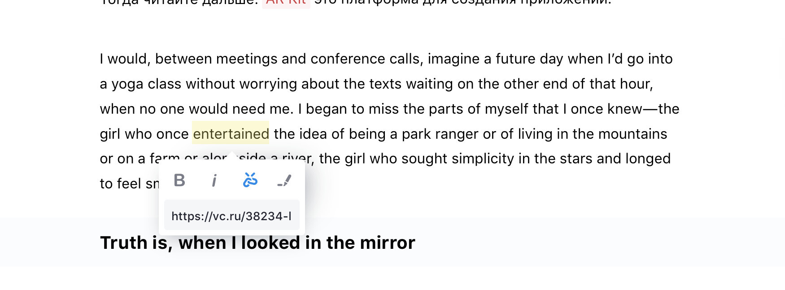

# So how to use Editor.js

## Basics

Editor.js is a Block-Styled editor. Blocks is a structural units, of which the Entry is composed. 
For example, `Paragraph`, `Heading`, `Image`, `Video`, `List` are Blocks. Each Block is represented by a Plugin. 
We have [many](http://github.com/editor-js/) ready-to-use Plugins and the [simple API](tools.md) for creation new ones.

So how to use the Editor after [Installation](installation.md).

- Create new Blocks by Enter or with the Plus Button
- Press `TAB` or click on the Plus Button to view the Toolbox
- Press `TAB` again to leaf Toolbox and select a Block you need. Then press Enter.


 
 
- Select text fragment and apply a style or insert a link from the Inline Toolbar



- Use «three-dots» button on the right to open Block Settings. From here, you can move and delete a Block 
or apply Tool's settings, if it provided. For example, set a Heading level or List style.

   

## Shortcuts

We really appreciate shortcuts. So there are few presets. 

Action | Shortcut | Restrictions
-- | -- | --
`TAB` | Show/leaf a Toolbox. | On empty block
`SHIFT+TAB` | Leaf back a Toolbox. | While Toolbox is opened
`ENTER` | Create a Block | While Toolbox is opened and some Tool is selected
`CMD+B` | Bold style | On selection
`CMD+I` | Italic style | On selection
`CMD+K` | Insert a link | On selection
 
Also we support shortcuts on the all type of Tools. Specify a shortcut with the Tools configuration. For example:

```js
var editor = new EditorJS({
  //...
  tools: {
    header: {
      class: Header,
      shortcut: 'CMD+SHIFT+H'
    },
    list: {
      class: List,
      shortcut: 'CMD+SHIFT+L'
    }
  }
  //...
 });

```

## Autofocus

If you want to focus Editor after page has been loaded, you can enable autofocus by passing `autofocus` to the initial config


```js
var editor = new EditorJS({
  //...
  autofocus: true
  //...
 });

```

## Holder
The `holder` property supports an id or a reference to dom element.

```js
var editor = new EditorJS({
  holder: document.querySelector('.editor'),
})

var editor2 = new EditorJS({
  holder: 'codex-editor' // like document.getElementById('codex-editor')
})
```


## Placeholder

By default Editor\`s placeholder is empty.

You can pass your own placeholder via `placeholder` field:


```js
var editor = new EditorJS({
  //...
  placeholder: 'My awesome placeholder'
  //...
 });

```

If you are using your custom `Initial Block`, `placeholder` property is passed in `config` to your Tool constructor.

## Log level

You can specify log level for Editor.js console messages via `logLevel` property of configuration:

```js
var editor = new EditorJS({
  //...
  logLevel: 'WARN'
  //..
})
```

Possible values:

| Value     | Description                  |
| -----     | ---------------------------- |
| `VERBOSE` | Show all messages            |
| `INFO`    | Show info and debug messages |
| `WARN`    | Show errors and warns only   |
| `ERROR`   | Show errors only             |
  
